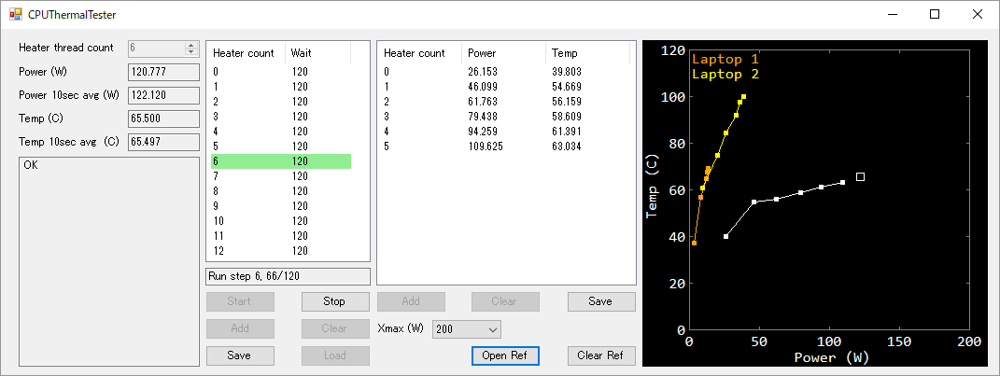

# CPUThermalTester

Utility software to measure the CPU cooling performance of PC.

## Getting Started

Download the [release](https://github.com/nshibano/CPUThermalTester/releases), start the application and click the "Start" button to start the automated measurement.

## Description

This software runs multi-threaded CPU stressing routine, minitors CPU power and temperature and plots the power vs temperature curve.

It has automated measurement function, that sweeps count of threads of the CPU stressing routine and captures power/temperature data, with appropriate delay to converge the temperature.

The gathered data can be saved into CSV file. The saved data can be loaded back to the application as reference data and can be compared in the plot window.

## License

MIT License

## Acknowledgement

This software uses library from [LibreHardwareMonitor](https://github.com/LibreHardwareMonitor/LibreHardwareMonitor) project to obtain sensor data of PC incluging CPU temperature and power dissipation.
